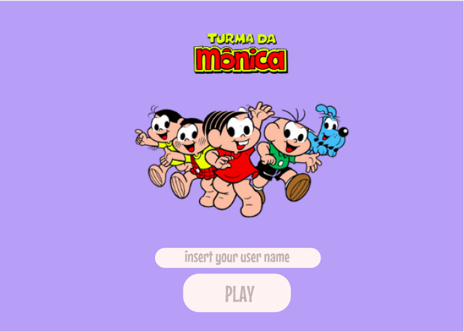
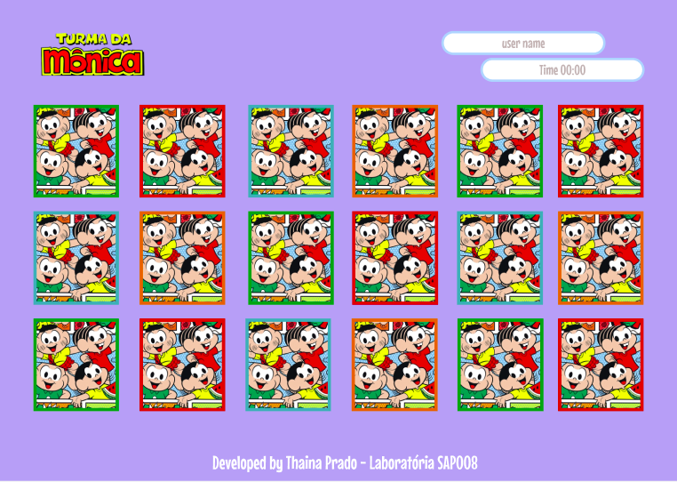
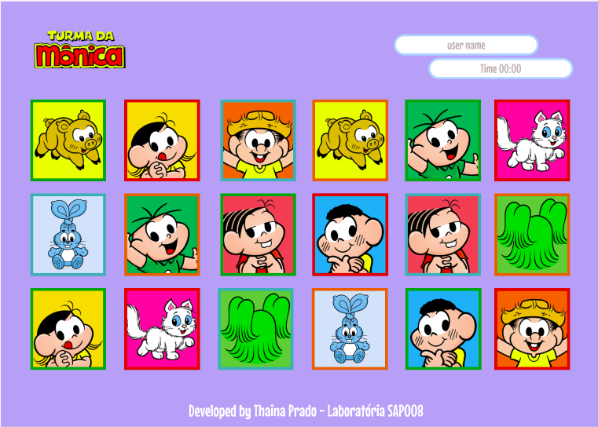
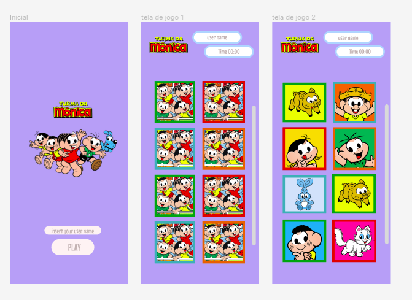

# Memory Match Game

## 1. Definição do Produto

Neste projeto criarei uma versão _web_ do jogo _Memory Match_, em
que um jogador possa jogar sozinha no navegador.

O objetivo principal deste projeto é aprender a desenhar e construir uma
interface web baseada em data e interação com os usuários.

## 2. Tema do Projeto e História - Turma da Mônica
Entender a importância das amizades: " Esse é um dos ensinamentos mais importantes que a turminha ensina a cada nova aventura! Ter amigos com quem contar é essencial em qualquer fase da vida, especialmente na infância. Cada amizade é única e, por isso, deve ser cultivada com muito carinho".

Os personagens da Turma da Mônica são ícones dos quadrinhos e da cultura pop brasileira, que estão sempre em contato com crianças (e adultos, como eu!) de várias gerações. O responsável pela propriedade intelectual é o criador Maurício de Sousa, artista responsável por delinear os traços de cada figura.

Durante décadas, os personagens vivem várias aventuras no icônico bairro dos Limoeiros, nas histórias em quadrinhos. Mas não é só na nona arte que essa turminha apronta. Atualmente, eles já alcançara, até mesmo, as telas do cinema.

Pensando no grande sucesso que se acumula por decadas, o projeto Memory Match recebe o tema Turma da Mônica, para divetimento das crianças e adultos em busca dos personagens perdidos nas cartas! 

## 3. Protótipo Alta-fidelidade

